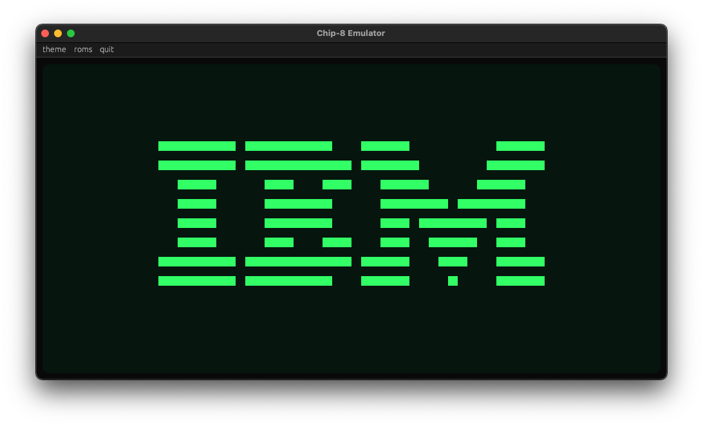

# Chip-8

A Chip-8 emulator written in Rust.

<p float="left">
  
  
</p>

<p float="left">
  
  
</p>

ROMs should be located in the `roms` folder and have the `.ch8` extension.

### Build & Run

```console
cargo run --release
```
